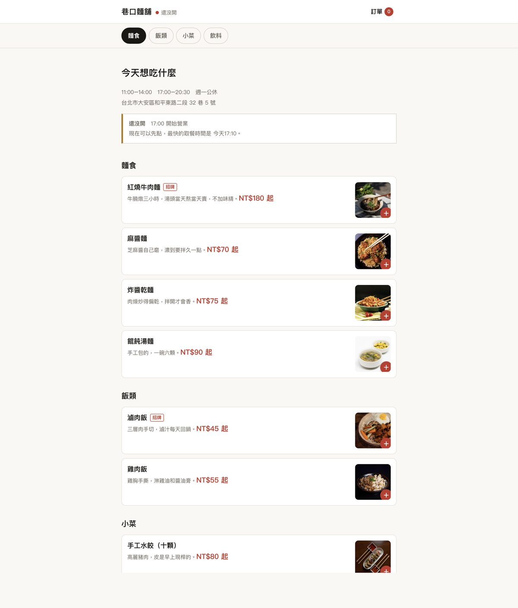

# 巷口麵舖 — 線上點餐示範

一間虛構麵店的完整點餐流程。**可以真的操作**：選餐點、加料改價、選取餐時間、送出訂單拿號碼。

**▶ [開始點餐](https://vicentelo0227.github.io/xiangkou-demo/)**



---

## 這是什麼

給餐飲客戶看的「預售屋」。沒有後端，但在客人手上會碰到的每一步都是真的——包含最麻煩的那一段：**加料要即時改價，而且必選項目沒選完不能送出**。

所有狀態存在瀏覽器的 `localStorage`，關掉分頁再回來訂單還在。沒有任何資料離開你的裝置。

## 做了哪些互動

| | |
|---|---|
| **選項即時改價** | 麵體、辣度、加料各自有加價，按鈕的金額跟著動。必選項目沒選完，「加入訂單」按鈕會停用並告訴你還缺什麼 |
| **依真實時間營業** | 頁首顯示現在營不營業，是讀你裝置的當下時間算的。午餐時段過了就顯示晚餐幾點開 |
| **取餐時段** | 從「現在 + 備餐 20 分鐘」開始，每 10 分鐘一個，只給營業時間內、且打烊前 15 分鐘截止。今天沒得選就自動給隔天的 |
| **打烊也能預約** | 沒營業時不是把人擋在門外，而是切換成預約下一個時段——真實點餐 app 都是這樣 |
| **內用／外帶／外送** | 外送有低消與免運門檻，沒到低消按鈕會擋住並說還差多少 |
| **單品備註** | 「不要香菜」這種要跟著那一碗走，不是整筆訂單一個備註 |
| **分類跳轉** | 捲到哪一區，上方分類列就標哪一個 |
| **取餐號碼** | 送出後給兩位數號碼，跟店裡叫號一樣 |

## 關於付款

不會出現信用卡號欄位。真實案子這裡會接金流商（綠界／藍新／LINE Pay）的安全欄位，或直接到店付款——卡號不該經過店家自己的網站。

## 技術

原生 HTML / CSS / JavaScript。**沒有框架、沒有建置流程、也沒有網頁字型**——全站走系統中文黑體，開啟時不用等字型下載。

```
index.html      菜單（分類跳轉 + 客製面板）
cart.html       訂單確認（改數量、選取餐方式）
checkout.html   選時段、聯絡方式、付款
done.html       取餐號碼
js/data.js      菜單、選項與加價
js/hours.js     營業時間與可取餐時段的計算
js/store.js     訂單狀態與 localStorage
js/ui.js        頁首、底部列、客製面板
```

全站約 400 KB（含全部餐點照片）。

幾個刻意的做法：`localStorage` 讀寫都包 `try/catch`（無痕視窗會直接丟例外）；載入時就把已下架品項與異常數量清掉，畫面索引才不會跟內部陣列錯開；css/js 的網址帶版本號，避免部署後新舊檔案混用；客製面板改選項時只更新變動的部分，不整塊重繪，鍵盤焦點才不會被彈掉。

## 素材

餐點照片來自 [Pexels](https://www.pexels.com)（可商用授權）。「巷口麵舖」品牌、菜色、價格、地址、電話全部虛構。

## 授權

MIT
